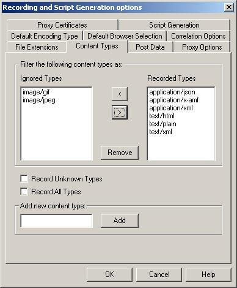
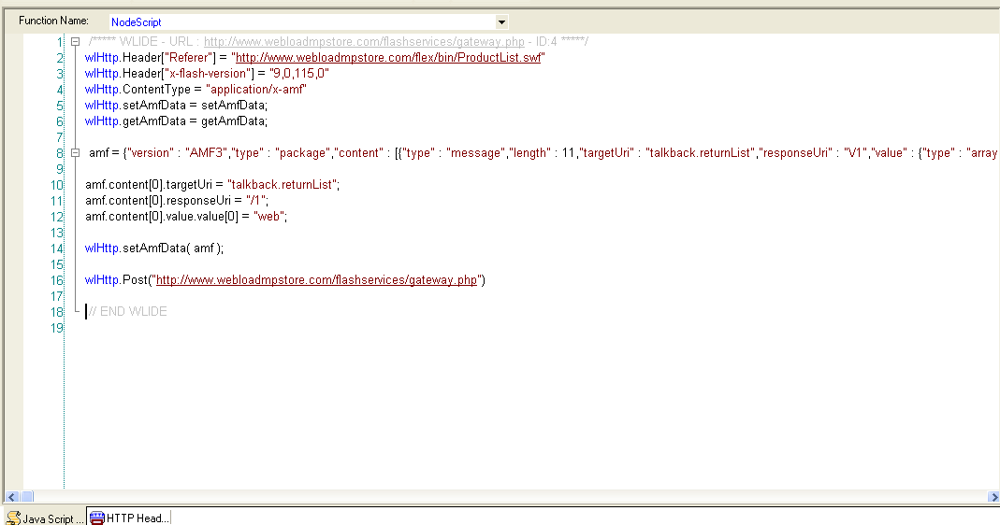
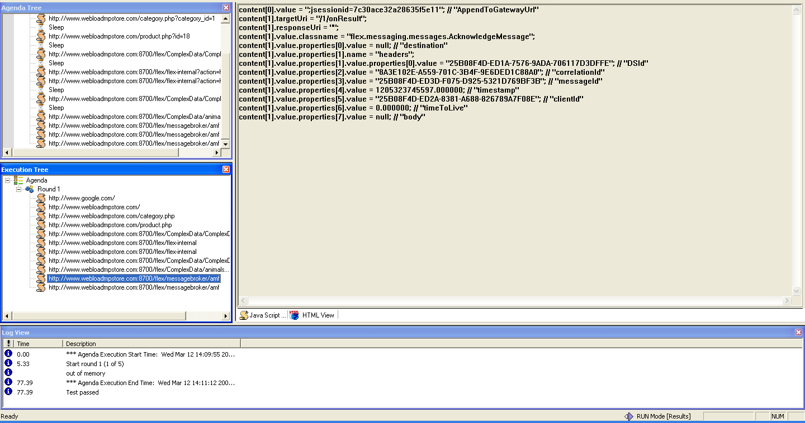
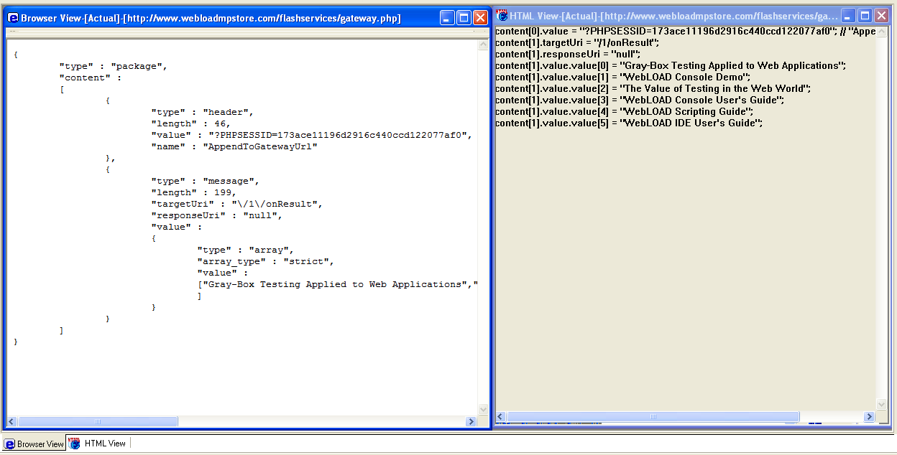
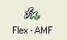
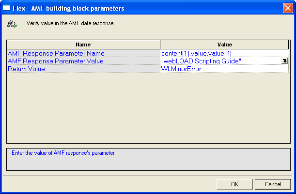

# Creating Scripts with AMF Messages

A script containing AMF messages is automatically generated during the recording procedure. WebLOAD analyzes the binary AMF content and decodes it into a tree data structure, which is translated into a JSON string. The JavaScript interpreter then evaluates the JSON string and creates a JavaScript object, which represents the AMF message. Finally, the JavaScript object is parsed and the JavaScript object representation of the AMF message is added to the script. For more information about the new syntax and the JavaScript representation of the AMF message, refer to *Editing the Script* (on page 12).

The AMF-related code in the script is synchronized with the full test code generated while recording general HTTP traffic, to create mixed scripts. For more information about mixed scripts, refer to *Creating a Mixed Script* (on page 19). You can browse the script and view the content of an AMF message. This content is presented in a readable format that fits the parameters of the scripting code related to the AMF message.

## Configuring WebLOAD to Record AMF Content

Use the Content Types tab in the Record Options dialog box to set up which types of Web content the WebLOAD Recorder records. For more information about content types, refer to *Configuring the Content Types to Record*, in the *WebLOAD Recorder User Guide*.

### To configure WebLOAD to record AMF content:

1. In the WebLOAD Recorder, select **Tools** > **Recording and Script Generation options**.

    The Recording and Script Generation options dialog box appears.

2. Select the **Content Types** tab.

    The Content Types tab moves to the front of the dialog box.

    

    *Figure 1: Content Types Tab*

3. Verify that the application/x-amf content type appears in the Recorded Types field.

4. Click **OK**.

   > **Note:** For more information about recording AMF traffic with additional binary content (such as RTMPT), refer to *Recording Binary AMF* (on page 28).

## Recording Flex Applications

Recording scripts containing AMF applications is done in the same way as you would record any other script. For more information about recording in the WebLOAD Recorder, refer to *Recording scripts*, in the *WebLOAD Recorder User Guide*.

You can view the recorded AMF content in the WebLOAD Recorder, while you are recording in the JavaScript View pane, or when you have finished recording in JavaScript Editing mode. For example:



*Figure 2: Script Containing AMF Messages -- JavaScript View*

While recording, you can also view the AMF content as a JavaScript object in the HTML View. For example:



*Figure 3: Script Containing AMF Messages -- HTML View*

## Recording Custom Serialized (IExternalizable) Objects

In ActionScript 3, a new interface (flash.utils.IExternalizable) has been introduced, based on the java.io.Externalizable interface. This new interface enables you to implement your own serialization method and control how the data is serialized in an AMF 3 stream. Typically, a custom serialization is used to avoid passing all of the properties of either the client-side or server-side representation of an object across the network tier. When you implement a custom serialization, you can determine that specific client-only or server-only properties are not passed over the network. When the standard serialization scheme is used, all public properties are passed by default back and forth between the client and the server.

In order for WebLOAD to record a custom serialization and avoid the corruption of the rest of the stream, the Flex add-on introduces the following solutions:

- **BlazeDS/LCDS implementation of Externalizable** -- The BlazeDS and LCDS include some IExternalizable objects that are simply serialized according to the AMF 3 specifications. These types are automatically detected during the recording and displayed as if they were encoded using the standard AMF 3 serialization scheme.

- **Custom implementation of Externalizable** -- Any other custom implementation of the Externalizable interface is recorded and displayed in a binary format.

- **Small messages** -- Sometimes, endpoints that use the AMF protocol use an optimization mechanism that reduces the size of messages transported across the network between clients and server--based messaging endpoints. The small messages optimization implements the Externalizable interface and should be handled by WebLOAD in one of the following ways:

  - By default, the small messages' AMF traffic, similar to other Externalizable traffic, is recorded and displayed in binary format.
  - Small messages can be enabled (turned on) or disabled (turned off) at the channel level (see *Disabling Small Messages*, on page 30). This allows you to disable small messages on the server and record and decode the traffic (JavaScript representation).

## Recording Binary-formatted AMF Messages

Using a Flex license, you can ignore the AMF decoding and generate scripts that contain the binary format of the AMF messages, instead of the JavaScript representation. For more information about recording the AMF binary traffic, refer to *Recording Binary AMF* (on page 33).

## Recording AIR Applications

The Adobe AIR container does not currently include proxy settings. Therefore, in order to be able to record the traffic between AIR applications and the remote server, set the environment Internet setting to pass through the WebLOAD Recorder. For more information on recording AIR applications, refer to *Recording Desktop Web Applications*, in the *WebLOAD Recorder User Guide*.

## Playing Scripts Containing AMF Messages

After you have recorded a script containing AMF messages, you can play it in the WebLOAD Recorder. For more information on script playback, refer to *Running a script*, in the *WebLOAD Recorder User Guide*. During playback, the JavaScript object that represents the AMF message is converted into the binary content object defined by WebLOAD. This object is attached to the wlHttp object and is sent to the server with the wlHttp post method.

During playback, the server response is represented as a JSON string in the Browser View and as a JavaScript object in the HTML View. For more information about these views, refer to *Viewing and Analyzing the Test Results*, in the *WebLOAD Recorder User Guide*. Viewing the HTML View and the Browser View simultaneously enables you to perform a simple verification of the results, as shown in Figure 4. For more information about verification options, refer to *Verification* (on page 9).



*Figure 4: AMF Script Displayed in HTML View and Browser View*

## Verification

The Adobe Flex Add-on provides a unique verification Building Block that you can drag and drop to a node in the Script Tree. This Building Block appears in the Verifications Toolbox. For more information about using the WebLOAD Recorder Building Blocks, refer to *Editing your Script Using the WebLOAD Recorder Toolbox Set*, in the *WebLOAD Recorder User Guide*.

 **Note:** The JavaScript representation of the AMF messages returned from the server appear in the HTML view. This provides an easy way to extract, analyze, and verify the value returned from the server.

### The WebLOAD Recorder Verifications Toolbox

The WebLOAD Recorder Verifications toolbox group includes the Flex - AMF Building Block.

#### To add Verifications Building Blocks to a test script directly through the WebLOAD Recorder:

- Drag the selected verification Building Block from the Verifications toolbox and drop it into the Script Tree immediately after the node that represents the AMF response.

  The Flex - AMF Building Block is described here:

  

  *Figure 5: Flex - AMF Building Block*

Each Verifications Building Block opens a different dialog box. Enter the required values in the Value fields. Explanations are provided at the bottom of the dialog box for each parameter as it is selected in the dialog box.

**Note:** The values that appear in the dialog box Value area are the default values for each field. In most cases, the default value for string variables is an empty string, indicated in the Value area by a set of empty quotation marks. If you are entering your own value for a string field, the new string must also be enclosed within quotation marks. Fields that were not assigned a value in the dialog box are left as empty fields in the script code.

A Verifications node is added to the Script Tree for each Verifications Building Block defined. WebLOAD Recorder automatically adds the corresponding JavaScript code to your test session script.

#### Flex - AMF

The Flex - AMF Building Block enables you to automatically generate a verification function in your script. During playback, the result of the verification process (failure or success) is returned and displayed in the Log View window.

**Note:** You can define the returned error level in case of failure. The default error level is WLMinorError.

#### To insert a Flex - AMF Building Block:

1. Drag the **Flex - AMF** icon from the Verifications toolbox into the Script Tree immediately after the node that represents the AMF response.

    The Flex - AMF dialog box opens.

    

    *Figure 6: Flex - AMF Dialog Box*

2. Edit the dialog box fields according to the following table.

    *Table 1: Flex - AMF Dialog Box Fields*

    | Field Name | Description | 
    |------------|-------------|
    | AMF Response Parameter Name | The JavaScript object to be verified. |
    | AMF Response Parameter Value | The desired response of the verification. |
    | Return Value | The error level returned in case of failure. |

3. Click **OK**.

The Flex - AMF node is added to the Script Tree. The JavaScript code, including the InitAgenda() function, is added to the script. To see the new JavaScript code, view the script in JavaScript Editing mode.

For example:

```javascript
function InitAgenda()
{
    // Start generation for Building Block Flex - AMF
    IncludeFile("amfVerification.js", WLExecuteScript);
    wlGlobals.SaveSource = true;
    // End generation for Building Block Flex - AMF
}
/***** WLIDE - BuildingBlock:Flex - AMF - ID:5 *****/
AMFResponse = wlHttp.getAmfData();
VerifyAMFResponse(AMFResponse, content[1].value.value[4], "WebLOAD Scripting Guide", WLMinorError);
content[1].value.value[4], "WebLOAD Scripting Guide", 
WLMinorError) 
// END WLIDE 
```

**Note**: After the verification function is created in the script, you can duplicate it several 
times within the script to verify different response values.