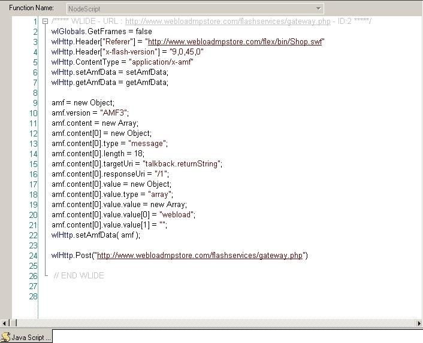
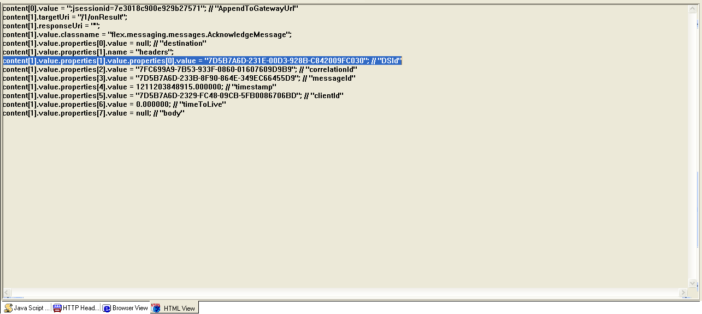
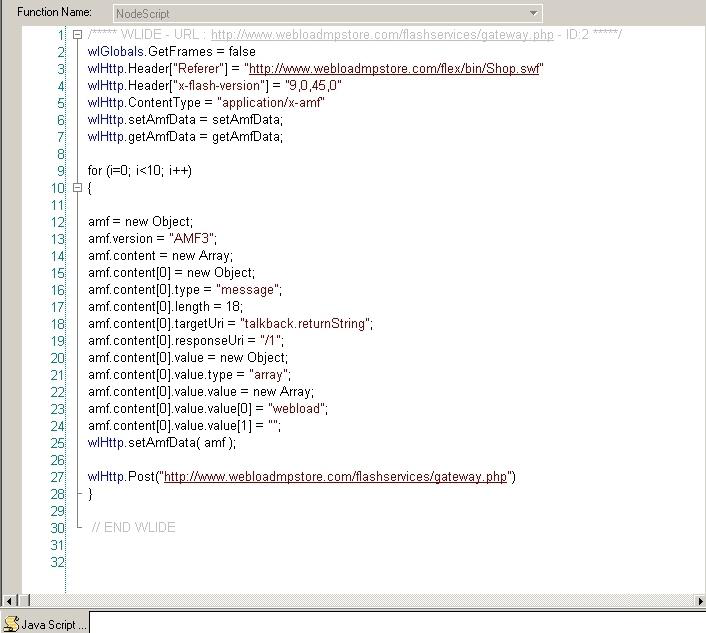

# Editing the Script

After recording an AMF message, you can edit it in JavaScript Editing mode.

## Parameterizing an AMF Message

The Adobe Flex Add-on enables you to parameterize an AMF message in your script. For example, you can record a Flex login operation and then edit the AMF message containing the login username in your script to simulate a different login operation without recording a new script. This way, you can easily simulate multiple logins with multiple usernames, recording only a single script.

For example, line number 20 of the script displayed in Figure 7 contains the word "webload". This word represents the word searched for in an AMF message that will be sent to the server. In JavaScript Editing mode, you can modify or replace this search word with any other that you wish to send to the server. Additionally, you can use the Global Input File Building Block to replace this search word with a parameter from an external file. For more information about the Global Input File Building Block, refer to *The WebLOAD Recorder General Toolbox* in the *WebLOAD Recorder User Guide*.

You can also copy and paste the pieces of code containing AMF messages into other parts of your script.



## Correlating the Script

When using the HTTP or AMF channel with any LCDS service (for example, remoting or messaging), the Flex application sends the server a unique identifier in the DSId message. This enables the server to track each Flex application interacting with it, including separate Flex applications running in different windows on the same client machine. To support the identification mechanism within the Flex application, the application server must be configured to use *sticky sessions*. This ensures that a single client's requests go to the same application server process instance.

If the *use sticky session* option is enabled on the application server, your recorded script will contain and display the DSId argument name and value. Therefore, you can manually extract the value sent in the first server response and assign it to the subsequent AMF requests. For more information about correlation, refer to *Correlating Scripts* in the *WebLOAD Recorder User Guide*.

The first server response that contains the DSId value can be seen in the following script:



The following examples represent the corresponding scripts that contain two AMF transactions with the DSId message. The *before* script is the native script as it was recorded and includes two AMF transactions.

**Before:**

**First AMF Transaction:**

```javascript
wlHttp.Header["Referer"] = "http://octopus:8700/flex/Flex361/main.mxml.swf"
wlHttp.ContentType = "application/x-amf"
wlHttp.setAmfData = setAmfData;
wlHttp.getAmfData = getAmfData;

amf = {"version" : "AMF3", "type" : "package" ... }

amf.content[0].targetUri = "null";
amf.content[0].responseUri = "/1";
amf.content[0].value.value[0].classname = "flex.messaging.messages.CommandMessage";
amf.content[0].value.value[0].properties[0].value = 5; // "operation"
amf.content[0].value.value[0].properties[1].value = ""; // "correlationId"
amf.content[0].value.value[0].properties[2].value = 0; // "timestamp"
amf.content[0].value.value[0].properties[3].name = "headers";
amf.content[0].value.value[0].properties[3].value.properties[0].value = "nil"; // "DSId"
amf.content[0].value.value[0].properties[4].name = "body";
amf.content[0].value.value[0].properties[5].value = null; // "clientId"
amf.content[0].value.value[0].properties[6].value = "7FC699A9-7B53-933F-0860-01607609D9B9"; // "messageId"
amf.content[0].value.value[0].properties[7].value = 0; // "timeToLive"
amf.content[0].value.value[0].properties[8].value = ""; // "destination"

wlHttp.setAmfData(amf);
wlHttp.Post("http://octopus:8700/flex/messagebroker/amf");
```

**Second AMF Transaction:**

```javascript
wlHttp.Header["Referer"] = "http://octopus:8700/flex/Flex361/main.mxml.swf"
wlHttp.ContentType = "application/x-amf"
wlHttp.setAmfData = setAmfData;
wlHttp.getAmfData = getAmfData;

amf = {"version" : "AMF3", "type" : "package" ... }

amf.content[0].targetUri = "null";
amf.content[0].responseUri = "/2";
amf.content[0].value.value[0].classname = "flex.messaging.messages.RemotingMessage";
amf.content[0].value.value[0].properties[0].value = null; // "source"
amf.content[0].value.value[0].properties[1].value = "getDrinks"; // "operation"
amf.content[0].value.value[0].properties[2].value = 0; // "timestamp"
amf.content[0].value.value[0].properties[3].name = "headers";
amf.content[0].value.value[0].properties[3].value.properties[0].value = "my-amf"; // "DSEndpoint"
amf.content[0].value.value[0].properties[3].value.properties[1].value = "7D5A8A36-FF0E-773D-CC0A-6563B281E638"; // "DSId"
amf.content[0].value.value[0].properties[4].name = "body";
amf.content[0].value.value[0].properties[4].value.value[0] = "Coffee";
amf.content[0].value.value[0].properties[5].value = null; // "clientId"
amf.content[0].value.value[0].properties[6].value = "9367C9ED-E37A-4735-36D9-016075DA6858"; // "messageId"
amf.content[0].value.value[0].properties[7].value = 0; // "timeToLive"
amf.content[0].value.value[0].properties[8].value = "bar"; // "destination"

wlHttp.setAmfData(amf);
wlHttp.Post("http://octopus:8700/flex/messagebroker/amf");
```

The *after* script includes the following code, which demonstrates the manual extraction of the DSId value from the server response:

```javascript
AMFResponse = wlHttp.getAmfData();
var myDSId = AMFResponse.content[1].value.properties[1].value.properties[0].value;
```

The following code is added to the subsequent AMF transactions:

```javascript
amf.content[0].value.value[0].properties[3].value.properties[1].value = myDSId // "DSId"
```

**After:**

**First AMF transaction:**

```javascript
wlHttp.Header["Referer"] = "http://octopus:8700/flex/Flex361/main.mxml.swf";
wlHttp.ContentType = "application/x-amf";
wlHttp.setAmfData = setAmfData;
wlHttp.getAmfData = getAmfData;

amf = {"version" : "AMF3", "type" : "package" ... }

amf.content[0].targetUri = "null";
amf.content[0].responseUri = "/1";
amf.content[0].value.value[0].classname = "flex.messaging.messages.CommandMessage";
amf.content[0].value.value[0].properties[0].value = 5; // "operation"
amf.content[0].value.value[0].properties[1].value = ""; // "correlationId"
amf.content[0].value.value[0].properties[2].value = 0; // "timestamp"
amf.content[0].value.value[0].properties[3].name = "headers";
amf.content[0].value.value[0].properties[3].value.properties[0].value = "nil"; // "DSId"
amf.content[0].value.value[0].properties[4].name = "body";
amf.content[0].value.value[0].properties[5].value = null; // "clientId"
amf.content[0].value.value[0].properties[6].value = "7FC699A9-7B53-933F-0860-01607609D9B9"; // "messageId"
amf.content[0].value.value[0].properties[7].value = 0; // "timeToLive"
amf.content[0].value.value[0].properties[8].value = ""; // "destination"

wlHttp.setAmfData(amf);
wlHttp.Post("http://octopus:8700

/flex/messagebroker/amf");

AMFResponse = wlHttp.getAmfData();
var myDSId = AMFResponse.content[1].value.properties[1].value.properties[0].value;
```

**Second AMF transaction:**

```javascript
wlHttp.Header["Referer"] = "http://octopus:8700/flex/Flex361/main.mxml.swf";
wlHttp.ContentType = "application/x-amf";
wlHttp.setAmfData = setAmfData;
wlHttp.getAmfData = getAmfData;

amf = {"version" : "AMF3", "type" : "package" ... }

amf.content[0].targetUri = "null";
amf.content[0].responseUri = "/2";
amf.content[0].value.value[0].classname = "flex.messaging.messages.RemotingMessage";
amf.content[0].value.value[0].properties[0].value = null; // "source"
amf.content[0].value.value[0].properties[1].value = "getDrinks"; // "operation"
amf.content[0].value.value[0].properties[2].value = 0; // "timestamp"
amf.content[0].value.value[0].properties[3].name = "headers";
amf.content[0].value.value[0].properties[3].value.properties[0].value = "my-amf"; // "DSEndpoint"
amf.content[0].value.value[0].properties[3].value.properties[1].value = myDSId; // "DSId"
amf.content[0].value.value[0].properties[4].name = "body";
amf.content[0].value.value[0].properties[4].value.value[0] = "Coffee";
amf.content[0].value.value[0].properties[5].value = null; // "clientId"
amf.content[0].value.value[0].properties[6].value = "9367C9ED-E37A-4735-36D9-016075DA6858"; // "messageId"
amf.content[0].value.value[0].properties[7].value = 0; // "timeToLive"
amf.content[0].value.value[0].properties[8].value = "bar"; // "destination"

wlHttp.setAmfData(amf);
wlHttp.Post("http://octopus:8700/flex/messagebroker/amf");
```
## Creating a Mixed Script

A mixed script contains AMF messages together with additional JavaScript commands. 
For example, you can add calls to HTTP pages with the POST command to repeatedly 
send an AMF message.



## AMF Object Syntax in JSON and JavaScript

WebLOAD manages AMF messages in a simple and flexible way by representing each 
AMF request/response as a JavaScript object. This JavaScript object is a treelike 
representation of the AMF message, in which each of its nodes represents an element 
of the AMF message.


WebLOAD’s JavaScript object representation of AMF messages enables you to modify 
particular AMF message parameters without generating new AMF requests every 
time. For more information about the JavaScript object representation of the AMF 
message, refer to setAmfData() (function) (on page 20).


The JavaScript object representation of an AMF message is generated automatically 
while recording a script. Alternatively, you can create it manually in the WebLOAD 
Recorder. For more information about automatically creating the AMF JavaScript, refer 
to Creating scripts with AMF Messages (on page 4). For more information about 
manually creating the AMF JavaScript object, refer to Sample Flex Script (on page 23).


## AMF-Related API Manual

This section provides details about the wlHttp object functions – getAmfData() and 
setAmfData(). The wlHttp object stores configuration information for immediate 
user activities, including properties defining expected dialog boxes, verification test 
selections, and dynamic state management. 


### getAmfData() (function)

**Function of Object**

- wlHttp (see wlHttp (object) in the WebLOAD JavaScript Reference Guide)

**Description**

Extracts the binary AMF message from the wlHttp object.  

**Example** 

wlHttp.getAmfData(); 

### setAmfData() (function) 

**Function of Object**

- wlHttp (see wlHttp (object) in the WebLOAD JavaScript Reference Guide) 

**Description**

Attaches the JavaScript representation of the AMF message to the wlHttp object.  

**Parameters**

| **Parameter Name** | **Description**                       |
|--------------------|---------------------------------------|
| amf                | The AMF message array containing the ActionScript objects. |

**Return Value**

None

The following table displays an example of the JavaScript representation of ActionScript objects in an AMF message:

| **ActionScript** | **JavaScript Example**                                     |
|------------------|------------------------------------------------------------|
| string           | value = "radview"                                         |
| object           | obj = new Object; obj.type = "object"; obj.classname = "class name"; obj.sealed_size = 12; obj.traits_reference = 3; obj.length = 203; obj.properties = new Object; obj.properties.type = "array"; obj.properties.value = new Array; obj.properties[0] = ... |
| double           | value = 1.5                                                |
| message          | msg = new Object; msg.type = "message"; msg.length = 203; msg.targetUri = "null"; msg.responseUri = "/1"; msg.value = ...       |
| boolean          | value = true                                               |
| xml              | xml = new Object; xml.type = "XML"; // or XMLDocument xml.value = "xml doc text";                                       |
| null             | value = null                                               |
| header           | header = new Object; header.type = "header"; header.must_understand = true; header.length = 203; header.value = ...       |
| array            | arr = new Object; arr.type = "array"; arr.value = new Array; arr.value[0] = "hello"; arr.value[1] = 1; arr.value[2] = false; |
| integer          | value = 1                                                   |
| date             | date = new Object; date.type = "date"; date.value = "Sat Jan 01 15:15:15 2000";                                           |
| bytearray        | bytearray = new Object; bytearray.type = "bytearray"; bytearray.length = 3; bytearray.value = "01A1DF";                     |
| undefined        | undef = new Object; undef.type = "undefined";              |
