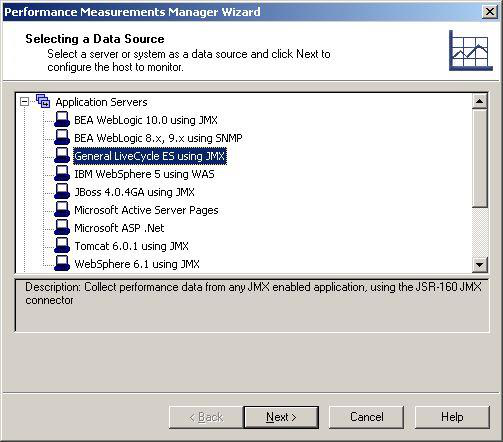
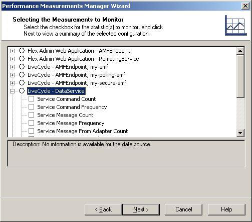

# Chapter 6: Monitoring LiveCycle Data Services ES Statistics

## Monitoring with Performance Measurements Manager (PMM)

The Performance Measurements Manager (PMM) can be utilized to monitor LiveCycle Data Services ES real-time measurements while your test is running. You can select different measurements on the LiveCycle Data Services host. Refer to the *Performance Measurements Manager* section in the *WebLOAD Console User Guide* for detailed information.

## Configuring Data Sources, Hosts, and Measurements

The Adobe Flex Add-on offers LiveCycle Data Services ES using JMX technology. LiveCycle Data Services ES employs Java Management Bean (MBeans) for run-time monitoring and management of configured services in the Flex services configuration file.

*Figure 10: Data Source Screen*

You can measure and monitor statistics related to LiveCycle Data Services ES and report the results. For detailed instructions on selecting measurements, consult the *Selecting the Measurements to Monitor* section in the *WebLOAD Console User Guide*.

*Figure 11: Measurements to Monitor on the LiveCycle Data Services ES Screen*