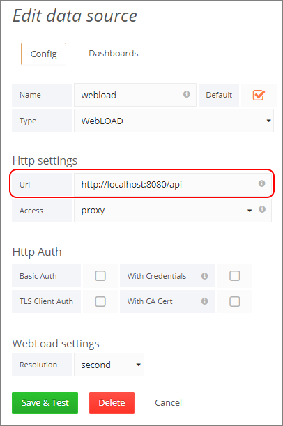
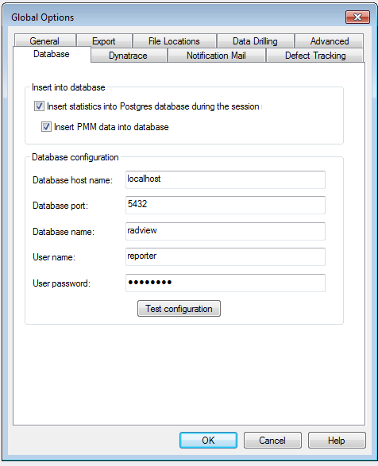

# Appendix

## Webload Dashboard Components

The WebLOAD Dashboard includes the following main components: 

- Back-end server, which listens on port 3000 by default.  

- Datasource server, which listens on port 8080 by default 

- Database server

### Editing Back-end Configuration

**Changing Back-end configuration**

You can change the back-end configuration by creating a file called `custom.ini` in `C:\\Program Files (x86)\\RadView\\WebLOAD\\dashboard\\grafana\\conf`.

Use the `default.ini`, located in the same location, to see the available configuration options. The following lists some common options. For a full description of all options, refer to the Grafana documentation at ...

```ini
[server]
# Protocol (http or https)
protocol = http
# The ip address to bind to, empty will bind to all interfaces
http_addr =
# The http port to use
http_port = 3000
# The public facing domain name used to access from a browser
domain = localhost

[security]
# default admin user, created on startup
admin_user = admin
# default admin password, can be changed before first start of grafana, or in profile settings
admin_password = admin

[users]
# disable user signup / registration
allow_sign_up = true
```

**Changing the Back-End Server's Listening Port**

You can change the port that the back-end server listens on, which is 8080 by default.

**To change the back-end server's listening port:**

1. Change the listening port value in the datasource configuration file, located in: `C:\\Program Files (x86)\\RadView\\WebLOAD\\dashboard\\webdashboard\\dashboard.settings.bat`f.

2. If you change the listening port in the datasource configuration file, you must reflect that change in the datasource configuration, as follows:
    - Select **Admin** > **Data Sources** in the WebLOAD Dashboard menu bar.
    - Click the **WebLOAD** data source,
    - In the Edit Data Source window that appears, change the **URL** to reflect the new address.

    

**Changing the WebLOAD Dashboard Database**

You can set which database the WebLOAD Dashboard is using by specifying the database in the datasource configuration file, located in `C:\\Program Files (x86)\\RadView\\WebLOAD\\dashboard\\webdashboard\\dashboard.settings.bat`.

Note that also the remote database itself must be configured for remote connections. Refer to *Configuring PostgreSQL to Allow Remote Database Connections* in the *WebLOAD Installation Guide*.

In addition, if you wish to import remote database sessions from the WebLOAD Console to the WebLOAD Dashboard while the sessions are running, do the following in the WebLOAD Console:

1. Select **Tools** > **Global Options** > **Database**.

    

2. In the **Database configuration** section, enter the details of the remote database.


## Index

### A
- Admin types
    - organizational admins ▪ 80 
    - super admins ▪ 80 
- Admins ▪ 80 
    - overview ▪ 80 
- Alert List 
    - overview ▪ 40 
- Annotating dashboards ▪ 57 

### B 
- Backend configuration 
    - changing listening port ▪ 94 
    - editing ▪ 93 

### C 
- Changing the zoom ▪ 41 
- Creating a new dashboard ▪ 61 
- Customizing 
    - panels ▪ 46 
    - rows ▪ 45 
- Customizing a dashboard 
    - overview ▪ 45 
    - saving settings ▪ 62 
- Customizing general dashboard settings ▪ 54 

### D 
- Dashboard components ▪ 35 
    - header ▪ 36 
    - menu bar ▪ 8 
    - panels ▪ 38 
    - rows ▪ 37 
- Dashboard List 
    - overview ▪ 40 
- Dashboard, using ▪ 35 
- Database, changing ▪ 95 
- Default (Home) dashboard, setting ▪ 9, 63 
- Deleting a dashboard ▪ 64 

### E 
- Exporting a dashboard ▪ 67 

### G 
- Getting started ▪ 7 
- Graph panel 
    - editing ▪ 47 
    - setting axes display ▪ 49 
    - setting display ▪ 51 
    - setting legend display ▪ 50 
    - setting time range ▪ 51 
    - specifying measurements per sessions ▪ 47 
    - overview ▪ 38 

### H 
- Header components ▪ 36 
- Home dashboard, setting ▪ 9, 63 

### I 
- Importing a dashboard ▪ 59 
- Importing remote sessions 
    - enabling in WebLOAD Console ▪ 5 
    - Installation instructions ▪ 4 
- Installing ▪ 4 
- Introduction ▪ 1 

### J 
- JSON file format 
    - exporting and importing dashboards ▪ 59 
    - viewing dashboard in JSON file format ▪ 67 

### L 
- Launching ▪ 7 
- Listening port, changing ▪ 94 
- Load Generators ▪ 75 
- Loading a dashboard ▪ 58 
- Log panel 
    - editing ▪ 52 

### M 
- Managing dashboards ▪ 58 
- Menu bar components ▪ 8 

### O 
- Online Help ▪ 2 
- Organization 
    - adding ▪ 87
    - editing
    - managing
- Organizational admins ▪ 80 
- Organizations ▪ 80 
    - overview ▪ 80 

### P
- Panels
    - adding ▪ 53 
    - Alert List ▪ 40 
    - customizing ▪ 46 
    - Dashboard List ▪ 40 
    - deleting ▪ 54 
    - duplicating ▪ 54 
    - editing general options ▪ 47 
    - editing graph panel ▪ 47 
    - editing singlestat panel ▪ 51 
    - editing table panel ▪ 52 
    - editing text panel ▪ 53 
    - Graph ▪ 38 
    - overview ▪ 38 
    - Plugin List ▪ 40 
    - Singlestat ▪ 39 
    - Table ▪ 39 
    - Text ▪ 39 
- Permissions ▪ 80 
- Playlist 
  - defining ▪ 9, 71 
  - running ▪ 9, 71 
- Plugin List 
  - overview ▪ 40 

### R
- Rows 
    - adding a row ▪ 45 
    - customizing ▪ 45 
    - deleting a row ▪ 46 
    - editing a row ▪ 45 
    - overview ▪ 37 

### S
- Saving a dashboard ▪ 62 
- Sessions, specifying ▪ 40 
- Sharing ▪ 65 
- Sharing a dashboard ▪ 65 
- Sharing a panel ▪ 67 
- Singlestat panel 
    - editing ▪ 51 
    - setting display styles ▪ 52 
    - overview ▪ 39 
- Super admins ▪ 80 

### T
- Table panel 
    - overview ▪ 39 
- Technical Support ▪ 3 
- Technical Support Website ▪ 3 
- Templating dashboards ▪ 57 
- Text panel 
    - editing ▪ 53 
    - overview ▪ 39 
- Time filter, setting ▪ 44 
- Time format, selecting ▪ 42 

### U
- User 
    - addition by Org admin ▪ 85 
    - creation by super admin ▪ 81 
    - editing by super admin ▪ 83, 86 
    - management ▪ 81 
    - management by Org admin ▪ 85 
    - management by super admin ▪ 81 
    - roles in organization ▪ 81 
    - types ▪ 81 

### V
- Viewing dashboard in JSON file format ▪ 67 

### W
- WebLOAD Dashboard components ▪ 93 
- WebLOAD Dashboard configuration ▪ 93 
- WebLOAD Documentation ▪ 1 
- Where to Get More Information ▪ 2 
- Working with WebLOAD Dashboard ▪ 11 

### Z
- Zoom, changing ▪ 41 
