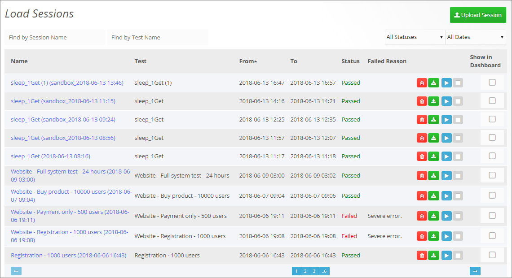
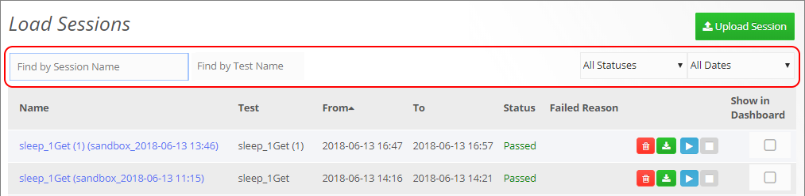
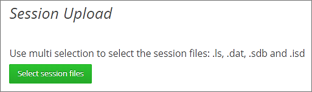

# Managing Sessions

## Viewing Load Sessions

In WebLOAD Dashboard, you can manage the following types of sessions:

- The sessions of load tests created and run in the WebLOAD Dashboard
- Sessions that were created in the WebLOAD Console and uploaded to the WebLOAD Dashboard. For instructions on how to upload sessions to the WebLOAD Dashboard, see *Uploading a session* (on page 30).

**To view the load sessions**:

1. In the menu bar, select **Sessions** > **Search**.

The Load Sessions table appears.

The Load Sessions table provides the following information and available actions for each Load Session:

| **Item**                               | **Description**                                                                                      |
|----------------------------------------|------------------------------------------------------------------------------------------------------|
| **Name**                               | The name of the load session. Clicking the name opens the Dashboard page for this session, enabling you to view the results of this session. |
| **Test**                               | The name of the corresponding load test.                                                             |
| **From**                               | The date and time when the load session started running.                                             |
| **To**                                 | The date and time when the load session finished running.                                            |
| **Status**                             | Whether the test passed or failed test execution.                                                    |
| **Failed Reason**                      | If the test failed, displays the reason for failure.                                                 |
|  | Instructs WebLOAD to delete this load session.                                           |
|  | Instructs WebLOAD to download the session results to the local computer. The results are downloaded as a zip file that contains the following files: .ls, .mdb, .sdb, .isd, .dat. You can then open the session in WebLOAD Console or WebLOAD Analytics. |
|       | Enables manually running a test created in WebLOAD Dashboard, now or at a specified time. Refer to *Scheduling a one-time test run* (on page 25). |
|       | Instructs WebLOAD to stop running the test.                                                          |
| **Show in Dashboard**                  | Enables specifying which sessions to display in the dashboard. This is very useful for comparing the statistics from multiple sessions. |

### Filtering the Load Sessions display

You can filter the Load Sessions table display by:

- **Session name**, using the **Find by Session Name** box.
- **Test name**, using the **Find by Test Name** box.
- **Test status**, using the **All Statuses** drop-down box.
- **Test date**, using the **All Dates** drop-down box.

## Uploading a session

You can upload to WebLOAD Dashboard, sessions that were created in the WebLOAD Console. Each session created in the WebLOAD Console consists of the following four types of files; to upload the session, you need to upload all four files:

- .ls - Load Session files
- .dat - Load Session data files
- .sdb - Statistics database files
- .isd - Index statistics database files

**To upload a session:**

1. Do one of the following:

   - In the menu bar, select **Session** > **Upload**
   - In the Load Sessions table, click **Upload Session**

The Session Upload page is displayed.

2. Click **Select session files**.

3. In the file explorer dialog that appears, navigate to the load session's files, select them, and click **Open**.