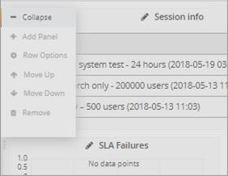
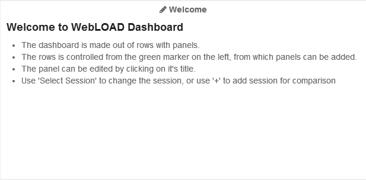
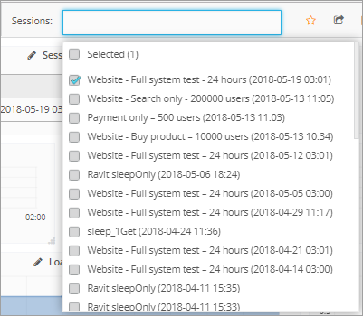
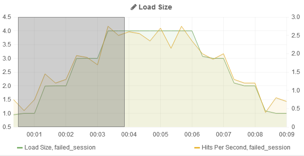
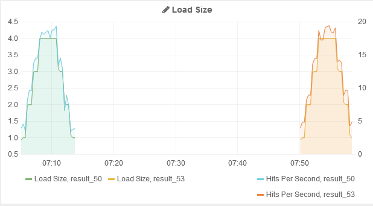
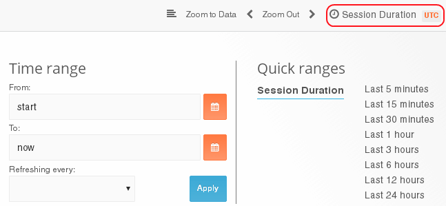

# Using Dashboards

The **Dashboards** tab enables viewing, analyzing, and comparing load sessions, with full control and customization of the display.

- For explanations of the various measurements in the graphs, refer to the *WebLOAD Console User's Guide*.
- For explanations of the log messages in the tables, refer to the *WebLOAD Console User's Guide*.

## Dashboards Tab Components

The high-level UI components of the **Dashboards** tab include:

- **Header**: Provides global settings, filters, and controls.
- **Rows**: Each row contains panels for data display.
- **Panels**: Display data in graph, text, table, singlestat, alert list, dashboard list, or plugin list format.

### Dashboard Header

The main components of the dashboard tab header include:

| **Item** | **Description** | **For more information, see** |
|----------|-----------------|-------------------------------|
| 1        | Dashboard name and selection | *Loading a Dashboard* (on page 59) |
| 2        | Select session | *Specifying the Sessions to view in the Dashboard* (on page 41) |
| 3        | Star or unstar a dashboard | *Loading a Dashboard* (on page 59) |
| 4        | Share dashboard | *Sharing a Dashboard* (on page 66) |
| 5        | Save | *Saving your Customized Dashboard* (on page 63) |
| 6        | Settings | *Customizing General Dashboard Settings* (on page 55) |
| 7        | Time format | *Selecting the Time Format* (on page 43) |
| 8        | Zoom to Data | |
| 9        | Zoom out | |
| 10       | Time picker | *Setting the Time Picker* (on page 45) |
| 11       | Refresh data | |

### Rows

A row is a horizontal container for panels. A row can be hidden (collapsed) and its height controls its panels' height.

- To add a new row, click **+ ADD ROW** at the bottom of a dashboard page.
- To edit a row, click the three grey dots and select the desired option. For more information, refer to *Customizing Rows* (on page 46).

### Panels

A panel is a data display unit. There are various types of panels -- such as graph, text, table, singlestat, Alert list, Dashboard list, and Plugin list.

- To add a new panel, click the three grey dots of the desired row and select **Add Panel**.
- To edit a panel, click the panel title and click **edit** in the box that appears. For more information, refer to *Customizing Panels* (on page 47).

#### Graph Panel

A graph panel presents session measurement data in graphic format. In each graph panel, you can display multiple measurements from multiple sessions. You can also set various display options, such as colors, graph style (lines, bars, points), Y-axis formats (bytes, milliseconds, etc.), and more.

#### Table Panel

A table panel presents data in table format; by default, the log messages from specified sessions. You can sort the display by various parameters and filter the display by severity.

#### Text Panel

A text panel presents text. You can edit the text.

#### Singlestat Panel

A singlestat panel is similar to a graph panel but shows only a single statistic, usually in numeric form. It may contain a 'sparkline' and may appear as a gauge. Note that because a singlestat panel displays only one measurement, it is not suitable when comparing two or more sessions.

#### Alert List Panel

Reserved for future use.

#### Dashboard List Panel

Reserved for future use.

#### Plugin List Panel

Reserved for future use.

## Specifying the Sessions to view in the Dashboard

WebLOAD Dashboard dashboards are useful both for analyzing the results of a specific session and for comparing the results of different sessions.

**To select a session for viewing in the dashboard tab:**

Do any of the following:

- In the Load Sessions table, click the session name. The session appears in the currently selected dashboard.
- In Load Tests table, click the Show Last Session button.
- To select multiple sessions for viewing in the dashboard tab, click **Show in Dashboard** for each session you wish to view in the Dashboard.

## Specifying the Zoom

Using a graph panel's zoom option, you can set the time period for which all panels display information. For example, if you select to zoom into the time period from 00:30 to 01:00, all panels will refresh to show information for that time period only, and the metric panels, for example, will display metrics for that time period only.

**To zoom in:**

Use the mouse to select a specific time range in the panel.

The dashboard refreshes to show the graph for the selected time range only.

**To zoom out:**

Use the **Zoom to Data** or **Zoom Out** options in the dashboard header.

## Selecting the Time Format

You can view dashboard data in either Relative time or Absolute time (see item ⑦ in Figure 33). This affects the graphs' display as follows:

**If you are viewing data for a single session:**

-  **Relative time** -- The start time is shifted over to zero.
-  **Absolute time** -- Shows the real time. This format is useful for viewing currently running sessions.

**If you are comparing sessions:**

- **Relative time** -- The graph shows the two sessions as if they occurred concurrently (within the same timeframe).
  
- **Absolute time** -- The graphs show the real time.
  

### Setting the Time Picker

If you selected the Time Picker (see item ⑩ in Figure 33), you can set various time settings.

You can, for example, set the auto-refresh frequency.

